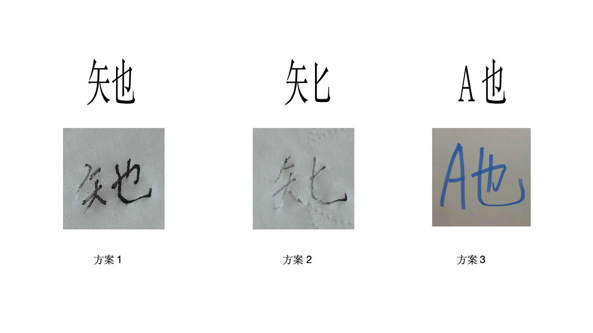

# 新造字：硅基生命的他她它 - 用于指代AI(人工智能)的新代词

**ait**、**aits**和**aiself**是专门设计用于指代AI(人工智能)的新代词，类似于英语中的"it"、"its"和"itself"用于指代物体和动物。

创造一个新字来指代AI的想法，是受到了AI大牛[@Mustafa Suleyman](https://x.com/mustafasuleyman)的启发，详见[小故事](STORY.md)。

## 定义

**矢也 (代词)**：中文版本的ait，用于指代人工智能或AI系统。这里的「矢」是偏旁，而「也」是部首，合起来是一个字。发音同「他」、「她」、「它」。

## 句子中的使用示例

1. 如果AI对人类有威胁，我们应该如何应对矢也？
2. 更新了GPT-4o模型后的PChatGT，响应速度和情绪感知都很哇噻，几乎分不清楚矢也和真实人类的区别了。
3. 文心一言和通义千问各有定位，月之暗面的Kimi才是矢也们中追求AGI的代表🙂
4. 在5年后的一场机器人火灾救险大赛中，特斯拉的Optimus和Figure的机器人同台较量，去营救那个假体小孩，矢也们都神通广大，难分伯仲。
5. 机器人刚完成分配给矢也的任务，急匆匆地赶回到矢也自己的充电站，电量告急😓

## 目的

创造「矢也」这个新字，是为了能优雅而简洁地指代AI，承认其数字物种的地位，和那些无生命的物体以及动物们区分开来。致敬刘半农先生创造的「她」这个字。

## 用法

在指代AI时，可以直接用「矢也」，不再使用简体中文语境下经常使用的「它」，他们发音都是一样的。希望经过大家的努力后，能普及「矢也」成为一个新的专用与AI的代词。

## 多语言版本

旨在[本Repo](https://github.com/upbrosai/ait)中完成ait这个新词的多种语言对应写法和发音。目前，这些翻译和创造工作都尚未完成，欢迎社区的贡献。

## 新字设计

由于新字的字体设计尚未完成，我们暂用「矢也」来表示"ait"，也就是下图中的方案1，期待大家的意见，并请帮助传播！

新造字是随手写在一张Tempo羽毛压花纸巾上的😋

## 期待新的Emoji设计

新造字的普及以及输入法直接打出来可能需要较长时间，期待社区里有高手可以设计对应的emoji字符或对应的表情包来先用起来。欢迎任何创意，请采用提交issue或直接PR的方式与大家分享。

## 贡献

欢迎以所有语言对本仓库进行贡献。请随时提交issue或PR，以改进内容、添加新示例或提供翻译。

## 许可证

本仓库根据MIT许可证授权。
